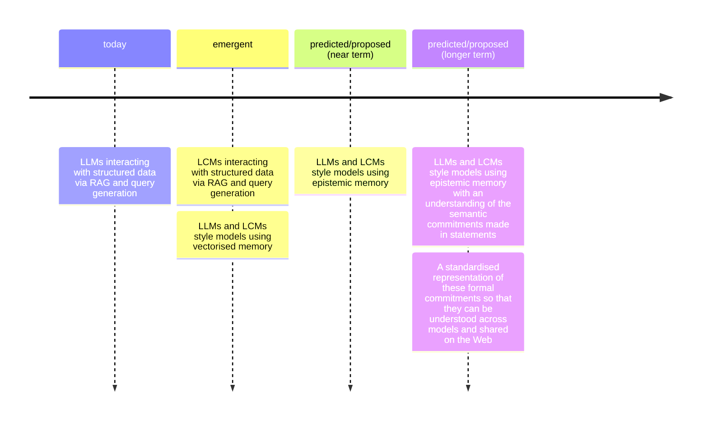

**EARLY STAGE DRAFT**

It is my view that we are nearing a point in the research landscape where papers, patents, standards documents, blogs and other long-form documents describing a dense set of ideas are nearing their end-of-life as the best mechanism for describing knowledge.

Other elements to observe:
 - When external sources are not easily referencable, a full story needs to be told up-front. The story whether in a paper or book, is not personalised to an individual consumer - but instead designed to be digestible by a wide audience of readers.
 - When external sources are more referenceable - such as on the Web where hyperlinks can be used. Authors have a level of liberty to create shorter documents and link users to external sources which they may consume at their own discretion.
 - When explaining something to someone in a conversation, I will piece together ideas that I have or know; but tailor that response to the person I am speaking to - for instance, based on how much they know about a particular topic - which informs what terms I can use vs. what terms I need to define in the process.

Roadmap[^1]:
 - Structured knowledge injection and production via RAG in LLMs
 - Model memory with some level of understanding of concepts (similar to LCMs)
 - Models actually working with concepts, and generating:
   - Formal commitments where possible
   - Indexes to point to databases containing knowledge required (i.e. look over there for a dataset of patient records that you need to answer this question).
 - Models able to actively identify which concepts they are operating with when performing inference, and able to pull in more information about that concept on-demand[^2].

---

Similarly, my view is that we should be developing such capabilities in order to enhance *collaboration* and *consensus*.

Near term possibilities for *collaboration* include:
 - Helping identify when multiple groups of people have a need for the same (e.g. software) infrastructure across multiple projects - and support pooling of resources to create one thing that can be re-used across projects. Note that this comes with the potential risk of loss in hetrogeneity in software - which comes with its own set of downsides and risks.
 - Distribution of shared next steps - identify when multiple groups have overlapping sets of tasks they want to achieve in the future and support them in distributing the workload. This is a very real problem that can be seen in the way that e.g. academic grants are currently managed wherein multiple institutions often try to outcompete each other to present a better grant proposal on similar hot topics of research in order to get funding.
 - Real-time matching of individuals with given skillsets to tasks that need to be done in a project.
 - There is a statistic that if you have $n$ people in an organisation than $\sqrt{n}$ of the people to $n$ of the work. It would be interesting to see if something like this could be used to induce a more 1:1 scaling - or at least use such metrics to evaluate the efficacy of this idea.

Near term possibilities for *consensus* include:
 - [Harmonisation of standards](https://en.wikipedia.org/wiki/Harmonization_(standards))
 <!-- THIS IS WHAT WE SHOULD TRY AND GET OMS FUNDING FOR -->
 - Topic based consensus amongst large groups - individuals discuss their needs, wants and priorities with their model which goes off to represent their views. This would enable democracy at the level of issues rather than elected representatives. This is crucial since top-down governance results in lack of granular awareness of issues faced by many people - and thus is not able to make the most effective decisions possible - or even make decisions that contradict public desires[^3]. A further indication that this is a sensible path to pursue is in those countries have demonstrated the effectiveness of citizen-led budget planning[^4].

[^1]: Note there is overlap with ideas in work/literature on interpretability of models.
[^2]: Note that one driver to try and build such architectures is that this would enable core models to be much smaller and to fetch relevant knowledge as needed on demand. This may also remove the need for knowledge cut-off dates if any new information published can quickly be pre-processed into concepts. This would also enable the use of private and other transactional data on-demand without needing to use RAG techniques.
[^3]: https://www.nbcnews.com/politics/trump-administration/poll-trump-faces-early-challenges-economy-united-gop-backs-big-change-rcna195860?utm_source=NBC&utm_medium=iframely
[^4]: Discussed in [Humankind: A Hopeful History](https://en.wikipedia.org/wiki/Humankind:_A_Hopeful_History) - I owe a page reference.