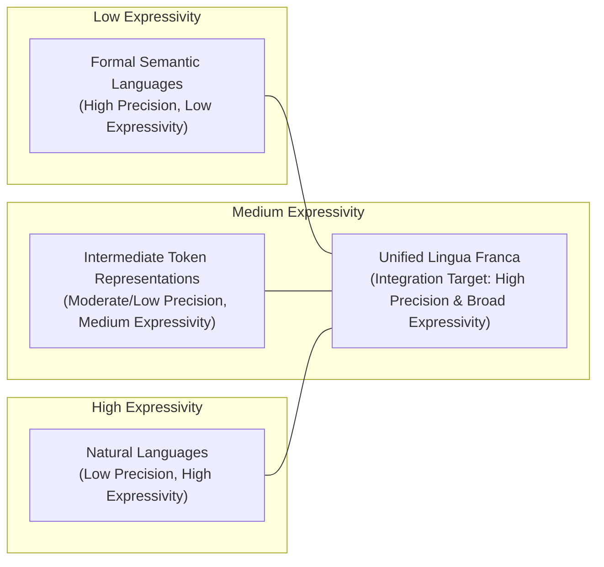

... that I'm interested in but don't have time to work on at the moment.

If you're looking for topics specifically related to Solid and data sovereignty look [here](https://github.com/solid/research-topics).

If you're looking for some more topics related to semi-autonomous Web Agents look [here](https://jeswr.solidcommunity.net/public/iswc_doctoral_consortium.pdf).

## Suitable Representations

*Kind-of-ok LLM generated mermaid diagram*

Formal semantic languages such as RDF encoded description logics (which in most profiles has a sub first-order expressivity), are a good means of precisely describing information – supporting interpretability and interoperability of data between systems. For much data with clear-cut attributes like the address, DOB, and website of a user – these languages can capture full information.

However, the fact that these languages are constrained to a particular logical profile, (e.g. First Order Logic) means that there – by definition - is a limitation to what they can express. In contrast, natural languages such as English are highly expressive – and have no formal ruleset to describe how the language should be interpreted and executed. Instead, the only systems to date that can operate upon the full spectrum of natural language (including the human brain, LLMs and other machine learning systems) are those which have learned by example; and thus, will have contextually dependent interpretations and reactions to the language. Moreover, multilingual speakers often attest to the idea that there are gaps in the expressible concepts between different languages – thus indicating that contemporary natural language does not effectively capture of all concepts relevant to daily life – let alone all concepts that could be communicated by a human or machine.
In the context of communication between LLMs, there is an emergent discussion of whether it would be appropriate to communicate using intermediate token representations rather than natural language. In theory this may improve expressivity but will nevertheless remain restricted to the conceptual model that lives within LLMs.

If we are to work towards a Web of Agents that accurately and effectively [negotiate, communicate and cooperate](https://www.cs.ox.ac.uk/people/michael.wooldridge/pubs/imas/IMAS2e.html) with maximal versatility, efficiency and unambiguity (where versatility and efficiency are defined as per Section 3 of [this paper](https://arxiv.org/pdf/2410.11905)) then we must work towards the design of a lingua franca for inter-system communication that encapsulates all of these different language modalities.

Moreover, we observe that the process of describing a concept in a higher-order modality, may be seen as conceptual alignment to allow that concept to be operationalised across systems in a lower-order modality. We already see this today in the way that RDF taxonomies are created – the Data Privacy Vocabulary for instance creates a taxonomy of terms defining a range of purposes for which data may be used.  However, the definition of the purpose is still described using the natural language rdfs:description.

This means that whilst, for instance, an ODRL policy can be formalised using a first-order-logic calculus description with the ODRL data model and DPV terms; the implementation of a policy engine operationalising that description will still require a human (or LLM) to interpret the natural language and codify the actions the system should take when, for instance, one is permitted to use data for dpv:Marketing which is defined in natural language as “Purposes associated with conducting marketing in relation to organisation or products or services e.g. promoting, selling, and distributing”.
There is also a question of what, if anything, sits between formal-logic and natural language. [We are not the first to pose such a question](https://chatgpt.com/share/67abac98-8de0-800c-9114-2e72ac12164f).

I’m sure there is some interesting Thery of Mind type stuff to investigate in here if one was to start properly digging – but I am going to withhold from that until I decide if I am going to do research in this direction.
Guidance note I don’t think it is going to be possible to invent much of this in a top-down manner. Would start first in a use-case driven manner.

Possible intermediary points include:

- Normalised natural language (e.g. application of strict grammar rules and/or reduction to a concise and precise language.)
- Building hybrid KG / VDB architectures and understanding the internal representation + mapping between the two views may go a long way in assisting with the creation of this intermediate representation.

## Bootstrapping Web Agents

In [this paper](https://openaccess.city.ac.uk/id/eprint/34788/) we present a vision of how we can evolve from the current paradigm of Computer Using Agents (CUAs) towards Personal AI Agents reminiscent of the 2001 Semantic Web Vision Paper.

In [the same paper paper](https://openaccess.city.ac.uk/id/eprint/34788/), we posit that a migration towards a Web of self-describing agents will only be possible should we first bootstrap a critical mass of such agents from existing Web Services. This is particularly important when interacting with legacy services that may not have any active maintainers.
The core research questions here are:
  1. How does one discover the action space of a Website
  2. How does one describe that action space of said Website, e.g., with Semantic Web Service Descriptions
In parallel, we create the opportunity to begin to develop more bespoke search engines / indexing engines for a Web of Agents. In the same way that schema.org enabled Google to effectively index information embedded in Websites - including movie schedules - and present aggregate information at the top of a search result, this work creates the possibility to create an index of what range of actions a particular platform supports. 
